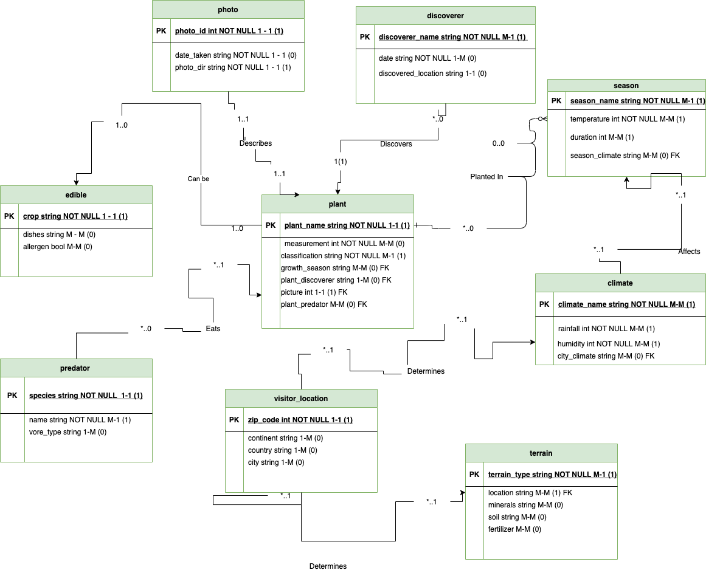
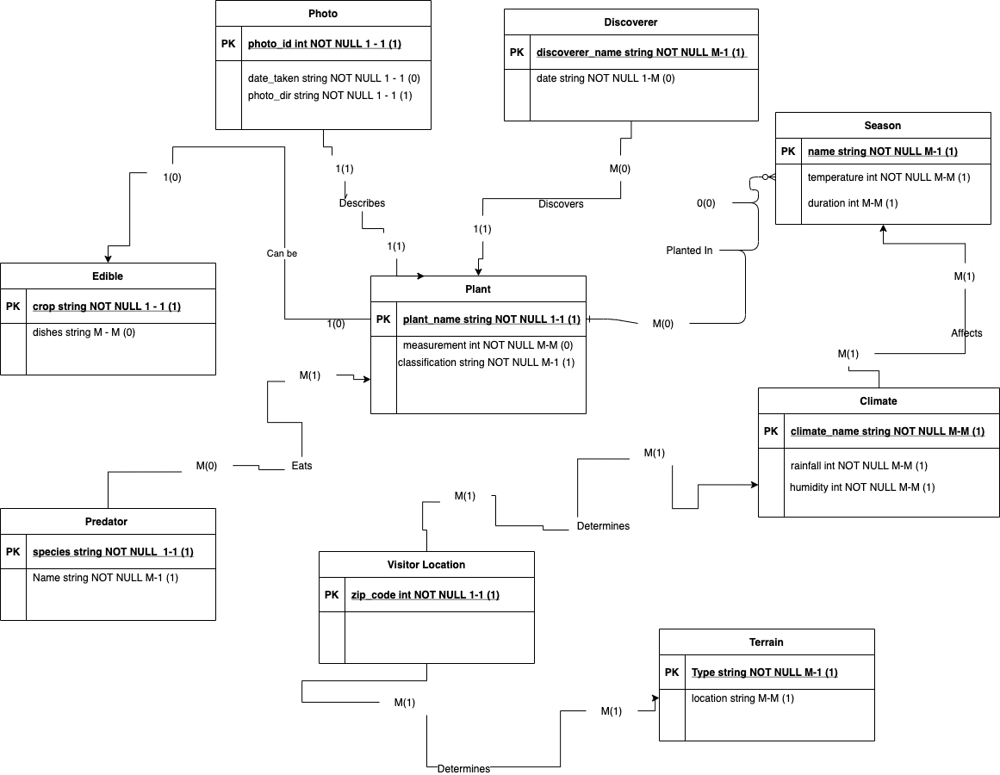

# Glossary

## Dependent entities 

| Entity Name      | Dependency |
| ----------- | ----------- |
| photo      | Dependent       |
| plant   | Master        |
| discoverer   | Dependent   |
| season   | Dependent        |
| climate   | Dependent        |
| terrain   | Dependent        |
| visitor_location   | Dependent  |
| predator   | Dependent        |
| edible   | Dependent        |

## Dependency relationship
| Entity Name      | Relationship |
| ----------- | ----------- |
| photo      | describes plant       |
| plant   | can be edible        |
| discoverer   | discovers plants, planted in season   |
| season   | NA        |
| climate   | affects season        |
| terrain   | NA        |
| visitor_location   | determines terrain  |
| predator   | eats plant        |
| edible   | NA        |

## Subtypes, supertypes and partitions
| Supertype      | Subtype |
| ----------- | ----------- |
| climate      | season       |
| trrain   | visitor_location |
| plant |  edible |

## Cascade, restrict on relationship
| Entity Name      | Relationship | CASCADE/RESTRICT
| ----------- | ----------- | ----------- |
| photo      | describes plant   | RESTRICT |
| plant   | can be edible        | CASCADE |
| discoverer   | discovers plants, planted in season   | RESTRICT | 
| season   | NA        | |
| climate   | affects season  | CASCADE |
| terrain   | NA        | |
| visitor_location   | determines terrain  | CASCADE |
| predator   | eats plant  | RESTRICT |
| edible   | NA  | |

## Cascade, restrict on foreign key
| Foreign Key      | CASCADE/RESTRICT
| ----------- | ----------- |
| season_climate  |  CASCADE |
| city_climate  |  CASCADE |
| location  |  CASCADE |
| growth_season  |  RESTRICT |
| plant_discoverer  |  CASCADE |
| picture  | CASCADE |
| plant_predator | CASCADE |

## Attribute types

> photo

| EntitiyName   | Type
| ----------- | ----------- |
| photo_id  |  INT NOT NULL|
| date_take  |  DATE NOT NULL |
| photo_dir (url) |  VARCHAR  NOT NULL|

> discoverer

| EntitiyName   | Type
| ----------- | ----------- |
| discoverer_name  |  VARCHAR NOT NULL|
| date  |  DATE NOT NULL|
| discoverer_location  |  VARCHAR |

> season

| EntitiyName   | Type
| ----------- | ----------- |
| season_name  |  VARCHAR NOT NULL|
| temperature  |  INT NOT NULL |
| duration  |  INT |
| season_climate  |  VARCHAR |

> climate

| EntitiyName   | Type
| ----------- | ----------- |
| climate_name|  VARCHAR NOT NULL |
| rainfall  |  INT NOT NULL |
| humidity  |  INT NOT NULL |
| city_climate | VARCHAR  |

> terrain

| EntitiyName   | Type
| ----------- | ----------- |
| terrain_type |  VARCHAR NOT NULL |
| location  |  VARCHAR |
| minerals  |  VARCHAR |
| soil | VARCHAR  |
| fertillizer | VARCHAR |

> visitor_location

| EntitiyName   | Type
| ----------- | ----------- |
| zip_code |  INT NOT NULL |
| continent  |  VARCHAR |
| country  |  VARCHAR |
| city | VARCHAR  |

> predator

| EntitiyName   | Type
| ----------- | ----------- |
| species |  VARCHAR NOT NULL |
| name  |  VARCHAR NOT NULL |
| cvore_type  |  VARCHAR |

> edible

| EntitiyName   | Type
| ----------- | ----------- |
| crop |  VARCHAR NOT NULL |
| dishes  |  VARCHAR |
| allergen  |  INT |

> plant

| EntitiyName   | Type
| ----------- | ----------- |
| plant_name |  VARCHAR NOT NULL |
| measurement (height)  |  INT NOT NULL |
| classification  |  VARCHAR NOT NULL |
| growth_season | VARCHAR |
| plant_discoverer | VARCHAR |
| picture_id | INT | 
| plant_predator | VARCHAR |

Entity Name: Plant

Synonyms: Flora, Vegetation

Description: A living organism of the kind exemplified by trees, shrubs, herbs, grasses, ferns, and mosses, typically growing in a permanent site, absorbing water and inorganic substances through its roots, and synthesizing nutrients in its leaves by photosynthesis using the green pigment chlorophyll.

---
Entity Name: Season

Synonyms: Period, Time

Description: Each of the four divisions of the year (spring, summer, autumn, and winter) marked by particular weather patterns and daylight hours, resulting from the earth's changing position with regard to the sun.

---

Entity Name: User Location

Synonyms: Area, Enviroment

Description: An actual place or natural setting.

---

Entity Name: Predator

Synonyms: Venator, Hunter, Killer

Description: An animal that naturally preys on others.

---

Entitiy Name: Edible

Synonym: Food, Nutriment, Ingrediant

Description: Fit or suitable to be eaten.

--- 

Entity Name: Terrain

Synonym: Land, Ground

Description: A stretch of land, especially with regard to its physical features.

---

Entity Name: Photo

Synonym: Image, Picture

Description: A representation of the external form of a person or thing in art.

---

Entity Name: Discoverer

Synonym: Explorer, Originator

Description: The first person to find or explore a place.

---

Entity Name: Climate

Synonym: Region, Area, Zone

Description: The weather conditions prevailing in an area in general or over a long period.

### Diagram, Maxima and Minima relationship and attribute 

